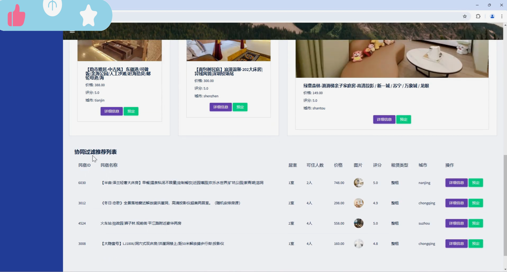
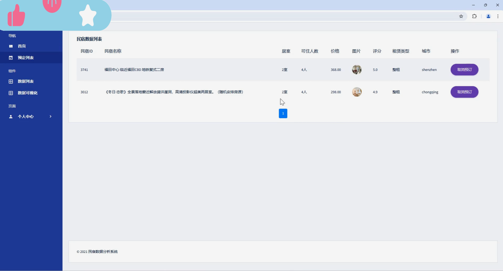
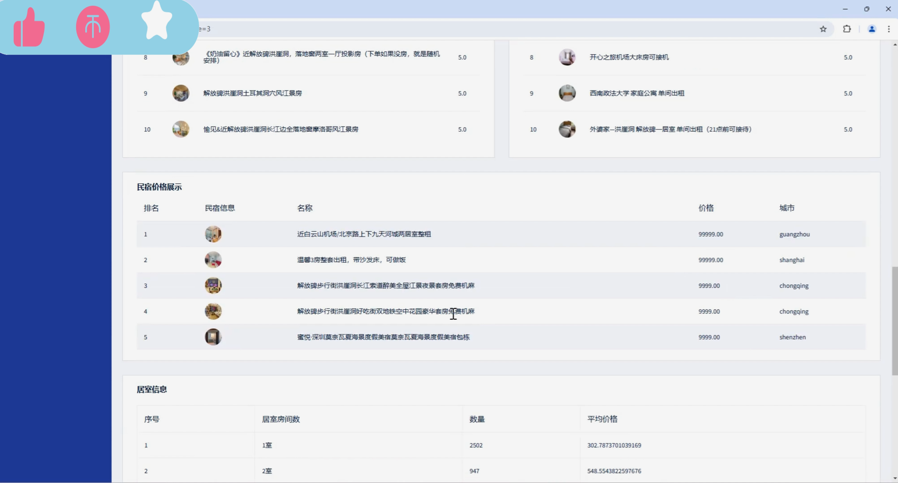
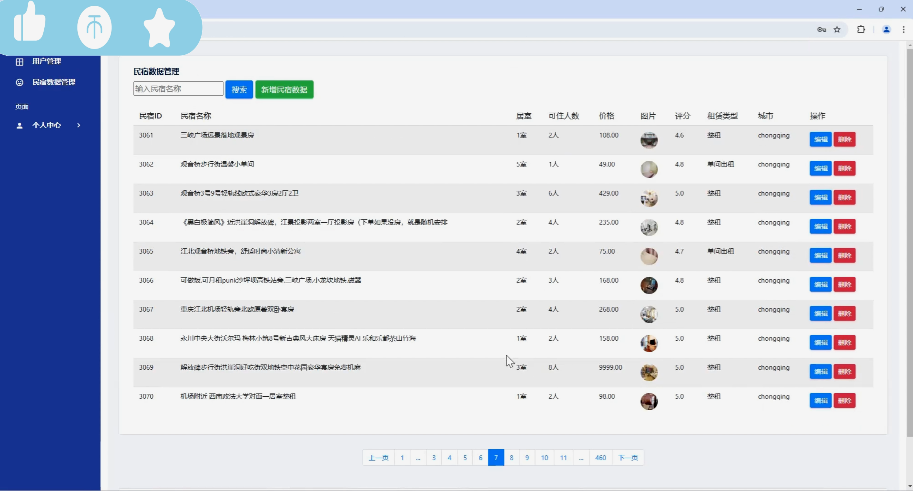

## 计算机毕业设计hadoop+spark民宿推荐系统 民宿数据分析可视化大屏 民宿爬虫 民宿大数据 知识图谱 机器学习 大数据毕业设计

## 要求
### 源码有偿！一套(论文 PPT 源码+sql脚本+教程)

### 
### 加好友前帮忙start一下，并备注github有偿民宿推荐系统
### 我的QQ号是2827724252或者798059319或者 1679232425或者微信:bysj2023nb

# 

### 加qq好友说明（被部分 网友整得心力交瘁）：
    1.加好友务必按照格式备注
    2.避免浪费各自的时间！
    3.当“客服”不容易，repo 主是体面人，不爆粗，性格好，文明人。
## 功能
1、数据获取：通过python爬取木鸟民宿数据
2、数据清洗：使用pandas进行数据清洗
3、数据存储：清洗后的数据存储到hdfs
4、数据分析：使用hive sql进行数据分析，分析后的数据通过Sqoop导出到mysql
5、数据可视化：使用echarts进行数据可视化
6、推荐算法：使用Spark实现als推荐算法，根据用户行为建模进行推荐。

## 演示视频
https://www.bilibili.com/video/BV1SqzRYCEq7/?spm_id_from=333.999.0.0

## 运行截图

